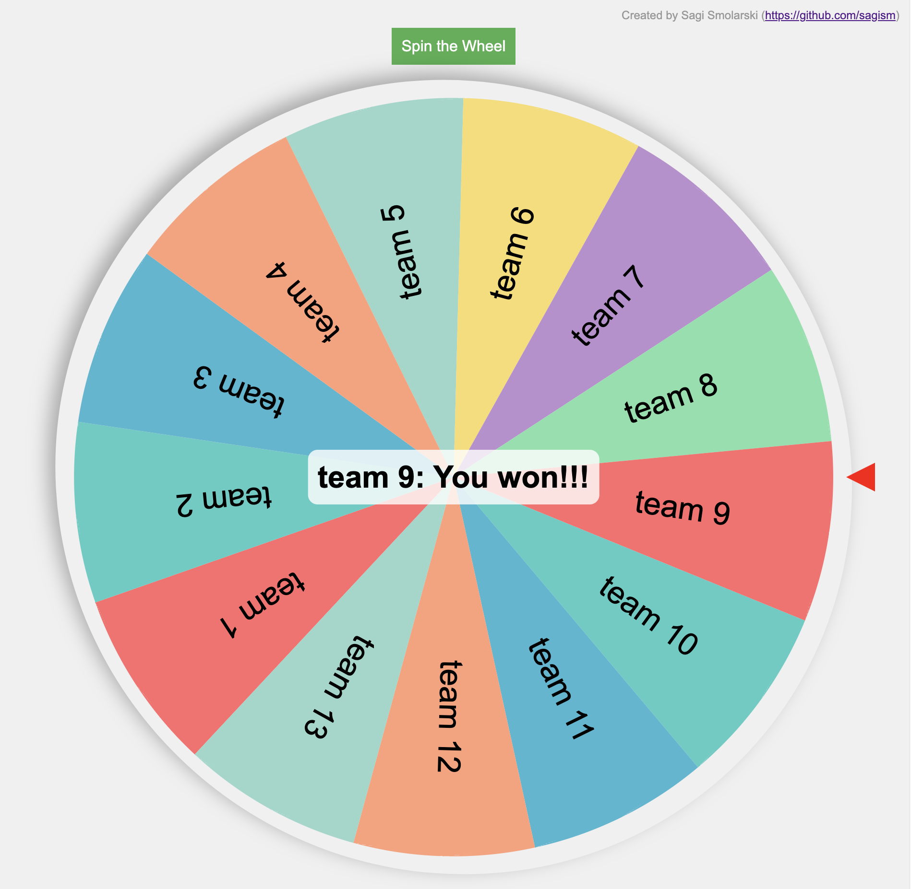

# Roulette
A self-contained web-based roulette to choose randomly between options

# Running
Just download the roulette.html file and open it in a browser (e.g. by double-clicking on it in your file explorer)

You can modify the values in a few ways:

1. Edit the values in the input below the roulette (when you hover on the input, the values are visible and can be editted. When you click on "Spin the wheel", the values will be updated on the roulette wheel before spinning. The values should be comma-separated. E.g `Jim Beam,Joe,Angelina`
2. Specifying the values in the url as a parameter called `items`. Eg. `file:///home/sagi/Documents/roulette.html?items=Jim%20Beam,Joe,Angeline`
3. By modifying the default values in the code.

# Modifications and Issues
Feel free to do a pull request or to open an issue if you wish.

# License
Please check the LICENSE file
